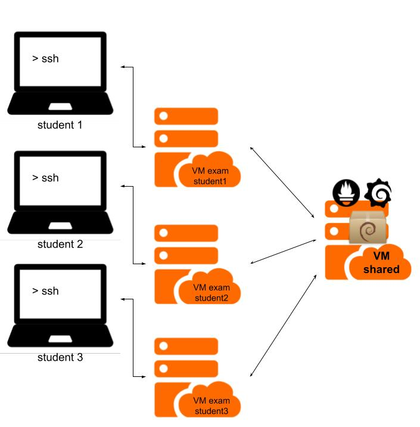

# ASIX M01UF2: Examen Linux
Examen autoavaluador de coneixaments de Linux bastas en M01-UF2 del Grau Superior de ASIX.  
_Autoevaluator test for Linux knowledge based on the M01-UF2 for ASIX professional course._

## Exam funcionality:

## Content
Aquest projecte incloud:
_This project includes:_  
- [deploy-files](deploy-files): Packer and terraform configurations to deploy the customized student machines + the centralized one.
- [prometheus configuration files](monitor/prometheus/)
- [Exam](exam/): The catalan and the english version of the presented test to the students.
